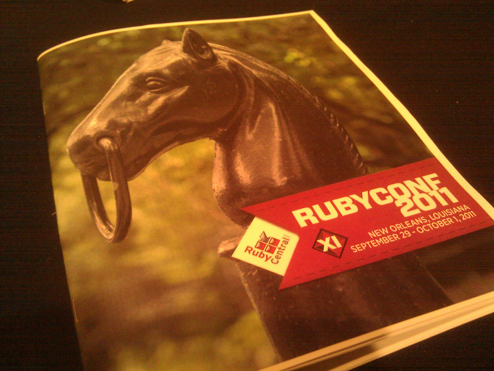
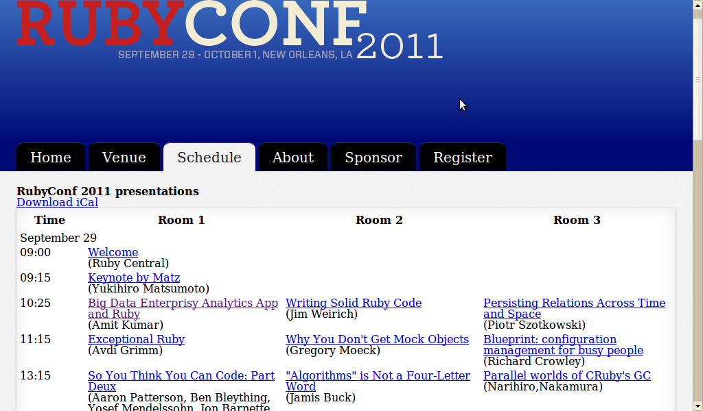

!SLIDE center basic-image
# RubyConf2011 FB
## Masaki Iwamoto

!SLIDE center smaller
# 自己紹介

## 岩本 政樹 (@masaki925)
## システム本部 IDCG (2008/04(新卒) 〜)
### ---- 外部活動など ----
### RubyKaigi2010 当日スタッフ
### Interop2011 STM
### RubyKaigi2011 当日スタッフ
### TokyoRubyKaigi05 実行委員

!SLIDE bullets
# Agenda

* 雰囲気
* セッション紹介
* Tips

!SLIDE bullets
* Agenda

# > 雰囲気
* セッション紹介
* Tips

!SLIDE neworleans center
## New Orleans, Louisiana

!SLIDE neworleans center
## Jazz の街

!SLIDE neworleans center
## 陽気な街

!SLIDE neworleans center
## 会場: Crown Plaza Hotel

!SLIDE neworleans center
## 会場の様子: Matz Keynote

!SLIDE bullets
* Agenda

* 雰囲気

# > セッション紹介

* Tips

!SLIDE sessions center
## 5〜7 sessions * 3 tracks * 3 days

!SLIDE sessions
## 聞いたやつ
- Keynote by Matz (Yukihiro Matsumoto)
- Big Data Enterprisy Analytics App and Ruby (Amit Kumar)
- Blueprint: configuration management for busy people (Richard Crowley)
- "Algorithms" is Not a Four-Letter Word (Jamis Buck)
- Advanced EventMachine (Jonathan Weiss)
- Release Early and Release Often: Reducing deployment friction (Andy Delcambre)
- Better Than ROT13 (Bradley Grzesiak)
- Rails services in the walled garden (Niranjan Paranjape, Sidu Ponnappa)
- MongoDB to MySQL: the How and the Why (Sarah Mei)
- Services Inception with Ruby (Dave McCrory)
- Ruby OpenSSL: Present, Future and why it matters (Martin Boßlet)
- Parallel Testing World (Shota, Fukumori)
- KidsRuby: Think Of The Children!  (Ron Evans)
- Test-drive the development of your command-line applications (David Copeland)
- Your tests are lying to you (Chris Parsons)
- Raising the Bar (Tyler Hunt)
- How GitHub Uses GitHub to Build GitHub (Zach Holman)
- Threading versus Evented (Dr Nic Williams)
- Advanced API design: how an awesome API can attract friends, make you rich, and change the world (Jonathan Dahl)
- MongoMapper, Mixins, and Migrations - a look at managing data-model complexity (Tim Connor)

!SLIDE sessions
## 理解できたやつ
- Blueprint: configuration management for busy people (Richard Crowley)
- MongoDB to MySQL: the How and the Why (Sarah Mei)
- How GitHub Uses GitHub to Build GitHub (Zach Holman)
- Advanced API design: how an awesome API can attract friends, make you rich, and change the world (Jonathan Dahl)

!SLIDE
# orz

!SLIDE sessions
## "理解できたやつ".gsub!('理解できた', '厳選した')
- Blueprint: configuration management for busy people (Richard Crowley)
- MongoDB to MySQL: the How and the Why (Sarah Mei)
- How GitHub Uses GitHub to Build GitHub (Zach Holman)
- Advanced API design: how an awesome API can attract friends, make you rich, and change the world (Jonathan Dahl)

!SLIDE sessions
## 厳選したやつ
- Blueprint: configuration management for busy people (Richard Crowley)
- MongoDB to MySQL: the How and the Why (Sarah Mei)
- How GitHub Uses GitHub to Build GitHub (Zach Holman)
- Advanced API design: how an awesome API can attract friends, make you rich, and change the world (Jonathan Dahl)

!SLIDE sessions
## 厳選したやつ

### > Blueprint: configuration management for busy people (Richard Crowley)
- MongoDB to MySQL: the How and the Why (Sarah Mei)
- How GitHub Uses GitHub to Build GitHub (Zach Holman)
- Advanced API design: how an awesome API can attract friends, make you rich, and change the world (Jonathan Dahl)

!SLIDE bullets incremental
## Blueprint: configuration management for busy people (Richard Crowley)

# 'Blueprint'
* => サーバーコンフィグ管理システム
* => Puppet, Chef の仲間

!SLIDE bullets incremental
## アプローチ
* Puppet, Chef
* => トップダウン(マニフェストを書いて、設定を適用)
* Blueprint
* => ボトムアップ(設定をして、マニフェストを生成)

!SLIDE
    @@@sh
    $ blueprint create foo
## => Reverse-engineers the server.
## => サーバの設定を探しまわってくれる

!SLIDE smaller
    @@@javascript
    class foo {
        Class['files'] -> Class['packages']
        class files {
            file {
                '/etc/apt/sources.list.d/devstructure.list':
                    content => template('foo/etc/apt/sources.list.d/devstructure.list'),
                    ensure  => file,
                    group   => root,
                    mode    => 0644,
                    owner   => root;
            }
        }
        include files
        class packages {
            class apt {
                package {
                    'openssh-server':
                        ensure => '1:5.8p1-1ubuntu3';
                }
            }
            include apt
        }
        include packages
        class services {
            class sysvinit {
                service { 'ssh':
                    enable    => true,
                    ensure    => running,
                    subscribe => Package['openssh-server'],
                }
            }
            include sysvinit
        }
        include services
    }

!SLIDE
    @@@sh
    $ blueprint show -S foo
## => Run foo.sh without installing Blueprint.
## => shell script が生成される。あとはこれを実行するだけで、(うまくいけば)同じサーバが作れる

!SLIDE smaller
    @@@sh
    #
    # Automatically generated by blueprint(7).  Edit at your own risk.
    #
    cd "$(dirname "$0")"
    mkdir -p "/etc/X11"
    cat >"/etc/X11/xorg.conf.failsafe" <<EOF
    Section "Device"
      Identifier  "Configured Video Device"
      Driver    "fbdev"
    ...
    EOF
    chmod 0644 "/etc/X11/xorg.conf.failsafe"
    mkdir -p "/etc/apm/resume.d"
    ln -s "../scripts.d/alsa" "/etc/apm/resume.d/20alsa"
    mkdir -p "/etc/apm/suspend.d"
    ln -s "../scripts.d/alsa" "/etc/apm/suspend.d/80alsa"
    mkdir -p "/etc/apt/apt.conf.d"
    cat >"/etc/apt/apt.conf.d/10periodic" <<EOF
    ...
    EOF
    
    chmod 0644 "/etc/apt/apt.conf.d/10periodic"
    mkdir -p "/etc/apt/preferences.d"

!SLIDE
    @@@sh
    $ blueprint show -P foo
    $ blueprint show -C foo
## => Puppet, Chef の形式にexport も可能。
## => 既存のシステムへの導入に使うと便利？

!SLIDE sessions
## 厳選したやつ

- Blueprint: configuration management for busy people (Richard Crowley)
### > MongoDB to MySQL: the How and the Why (Sarah Mei)
- How GitHub Uses GitHub to Build GitHub (Zach Holman)
- Advanced API design: how an awesome API can attract friends, make you rich, and change the world (Jonathan Dahl)

!SLIDE

## Diaspora というオープンソースのソーシャルネットワークプラットフォームにて、
## 開発当初より採用してきたMongoDB を、9ヶ月の運用の末 MySQLに乗り換えた理由について

### 冒頭の質問で、会場内で20人ほどがMongoDBを採用したことがあるとの挙手がありましたが、今も継続して利用しているのは半数ほどでした。

!SLIDE
## ひとつの理由はデータの性質によるもの。
### 当初はよくあるソーシャル系アプリに見られるフレキシブルなデータ構造を考慮してMongoDB を採用したが、
### 開発を進めていくうえでリレーションを持つデータが増えていき、SQLでいうJOIN をサポートしないMongoDB では効率的な実装に限界があった。
### ---
### QAにて、「Q.いくつまでのリレーションなら許容できるか？」
### 「A.明確ではないが、よくて2つ、3つを超えてくると転換点だと感じている」
### とのやりとりがありました。

!SLIDE
## もうひとつの理由はmapper に関係するもの。
### これに関しては、コミュニティの未成熟な点を指摘していました。
### 存在するbug, 少ないドキュメント、検索しても明確な答えは得られず、コミュニティも活発ではない。
### それによって開発のスピードが思うように加速できなかったとのことでした。

!SLIDE
### (もうひとつ、migration についても述べていましたが、うまく聞き取れませんでした。orz)

!SLIDE
### コミュニティという点では、
### 個人的には最近東京でのMongoDBに関する活動が活発な感がありますが、
### そのような活動がうまく英語圏のコミュニティと連携していければ、
### きっと多くの開発者がハッピーなことになるのではないかなと思いました:)

!SLIDE sessions
## 厳選したやつ

- Blueprint: configuration management for busy people (Richard Crowley)
- MongoDB to MySQL: the How and the Why (Sarah Mei)
### > How GitHub Uses GitHub to Build GitHub (Zach Holman)
- Advanced API design: how an awesome API can attract friends, make you rich, and change the world (Jonathan Dahl)

!SLIDE
## github 内でのワークスタイルについての話。

###「みんなgithub 使ってるよな？いえーい!」
### とでも言わんばかりの、サービスの勢いがそのまま現れているような、かなりノリノリのセッションでした。

### キーワードは
## - asynchronous (非同期)
## - simple

!SLIDE bullets incremental
## 非同期
* "THE ZONE" で仕事する
* 人間を待ったりしない，no meetingとかいう事
* やりとりは全てgithubのissues で行う。あとからの振り返りも可能。

!SLIDE smbullets incremental
## simple: pull requests + branching
* deploy-60とかdeploy-61とかdeploy-62とかdeploy-62bとかウゼー，
* pull request という便利なものがあるんだから，トピックブランチ→masterの
* pull requestを切ってレビューしてもらい，masterは常にdeployableであれ,
* CI についてもすべてのブランチをテスト可能にしておけ，という内容でした．

!SLIDE smbullets incremental
## simple: issue tracker
* redmineみたいに超項目が多いとダルいよねー
* まあわたしたちの issue trackerはこんなんだぜェ，シンプル便利便利!!みたいなノリでした．

!SLIDE smbullets incremental
## simple tool + better process = awesome product.

* 資料はこちら。
* http://zachholman.com/talk/how-github-uses-github-to-build-github

!SLIDE sessions
## 厳選したやつ

- Blueprint: configuration management for busy people (Richard Crowley)
- MongoDB to MySQL: the How and the Why (Sarah Mei)
- How GitHub Uses GitHub to Build GitHub (Zach Holman)
### > Advanced API design: how an awesome API can attract friends, make you rich, and change the world (Jonathan Dahl)

!SLIDE smbullets incremental
## API, 特にWeb業界における、APIのよいデザインとはどのようなものか？という話。

* 近年Webサービスが成長していくうえで重要な要素としてAPIがあるとし、
* APIの実装にあたってケアすべき点をいくつか挙げて、
* それに対して「例えばこんな場合、みんなならどう実装する？」というような参加者との対話が多く見られるセッションでした。
* => その分、内容を聞き取るのも困難でした。。

!SLIDE smbullets incremental
## ケアすべき点
* version 管理 (v1, v2, ...)
* REST
* HTTP status code
* error handling (何が、なんでダメで、どうすべきか)
* ドキュメント
* Request Builder
* etc...

!SLIDE smbullets incremental
* APIデザインの質と価値の関係は、スポーツのそれに似ている
* => 質がある一定の基準にならなければその価値はさほど上がらない(あまり使われない)

* またAPIはUIでもあり、実社会に存在している様々なインタフェースにも学ぶところがあるはずだ、という議論も。
* => 例として車が挙げられていましたが、内容は詳細には聞き取れませんでした。。

!SLIDE
### 個人的には結論は発散的な印象でしたが、もしかしたらAPI実装のベストプラクティス集や、
### API実装のためのライブラリやフレームワーク などがあれば需要があるのかもしれないな、と感じました。

!SLIDE
### スライド: おそらく下記(とほぼ同様)。
http://www.slideshare.net/jondahl/advanced-api-design-how-an-awesome-api-can-attract-friends-make-you-rich-and-change-the-world

!SLIDE bullets
* Agenda

* 雰囲気
* セッション紹介

# > Tips

!SLIDE smbullets incremental
## Tips
* 日本のコミュニティの一員になる。現地ではやはり心強い。
* セッション後、仲間と振り返る。やはり母国語のほうが理解度が深まる
* 予習しておく。summary に出てくるキーワードを調べておくだけでも理解度は違う
* 人を知る。その人がどんなことに興味を持って活動しているのかがわかれば、理解度もまた違う
* なにか武器を持つ。何かネタがないといろいろとつらい。
* つっこみどころのあるTシャツを着る。日本好きが話しかけてくる

!SLIDE bullets incremental
## 資料について
* confreaks というサービスで、資料が公開されるかも。
* るびま の記事にフィードバックが載るかも。

!SLIDE
# Thanks!

